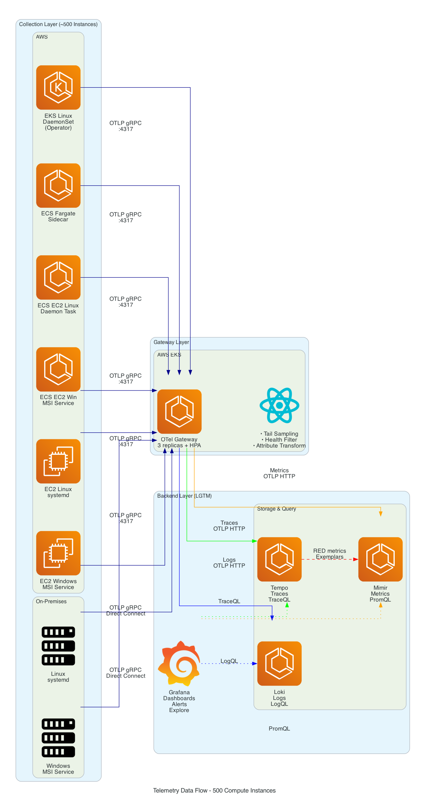
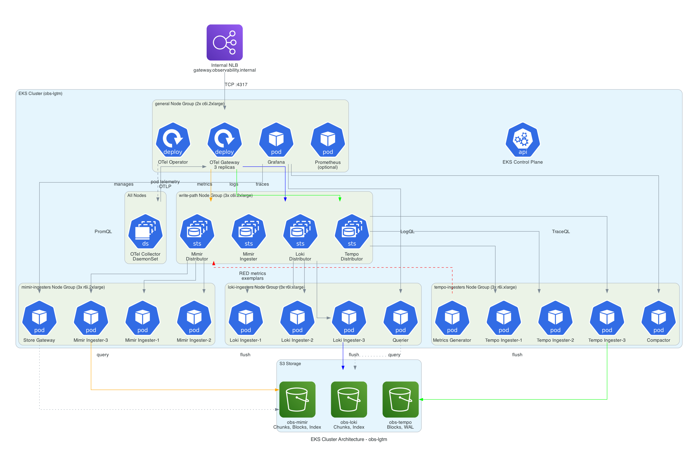
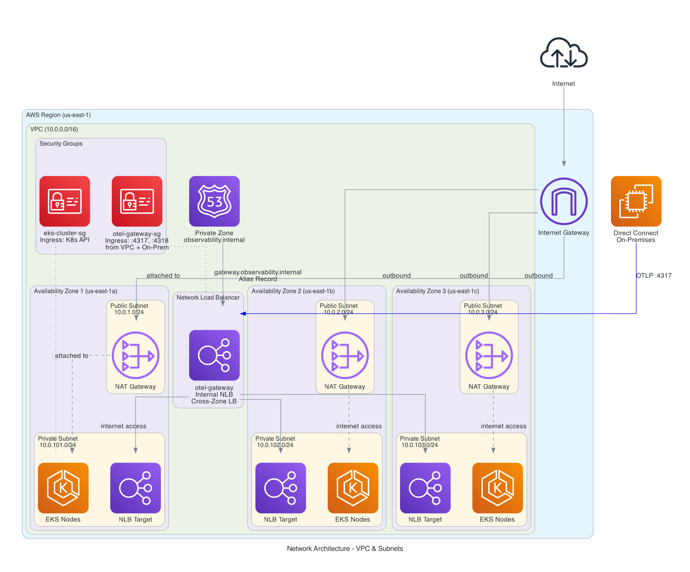

# Demo — Unified Observability Platform

End-to-end deployment of a unified observability platform on AWS EKS, covering metrics, logs, and traces across heterogeneous compute environments with minimal vendor lock-in.

**What this demonstrates** (per [challenge.md](../challenge.md)):

- Unified observability (metrics, logs, traces) using OpenTelemetry + Grafana LGTM stack
- Zero-code auto-instrumentation for Node.js microservices
- Agent-only collection for legacy apps that cannot be modified
- Cross-signal correlation: metrics to traces to logs in a single pane of glass
- Infrastructure as Code: Terraform, Helm, GitOps with ArgoCD
- Cost-optimized: ~$100-150/month for demo vs $12K+/month for SaaS at production scale

## Architecture

<p align="center">
  
</p>

<p align="center">
  
</p>

<p align="center">
  
</p>

<p align="center">
  
</p>

> Diagrams are generated from code — see [docs/diagrams/](../docs/diagrams/) for sources.

---

## Prerequisites

- AWS CLI configured (`aws configure` or `AWS_PROFILE`)
- Docker Desktop (for building ARM64 images)
- Terraform >= 1.5
- kubectl >= 1.28
- Helm >= 3.12

```bash
export AWS_PROFILE=your-profile
export AWS_REGION=us-east-1
export CLUSTER_NAME=obs-lgtm-demo
```

---

## Step 1 — Deploy AWS Infrastructure (~20 min)

Creates EKS cluster (2-10 Graviton Spot nodes), S3 buckets, IAM roles with IRSA, and ECR repositories.

```bash
make tf-init
```

```bash
make tf-plan-demo
```

```bash
make tf-apply-demo
```

**What gets created**: VPC with public/private subnets across 3 AZs, EKS cluster with managed node group (Graviton Spot), S3 buckets for Mimir/Loki/Tempo, IAM roles scoped per component via IRSA, ECR repos for demo app images, and a Cluster Autoscaler IAM role.

---

## Step 2 — Deploy LGTM Stack + OTel Collection

Deploys the full observability backend and collection layer.

```bash
make helm-repos
```

```bash
make deploy-all-demo
```

**What gets deployed**:

| Component | Role | Config |
|-----------|------|--------|
| **Mimir** | Metrics backend (PromQL) | S3 storage, IRSA, 1 replica per component |
| **Loki** | Logs backend (LogQL) | S3 storage, SingleBinary mode |
| **Tempo** | Traces backend (TraceQL) | S3 storage, metrics generator for RED metrics |
| **Grafana** | Visualization | Pre-configured datasources with cross-signal correlation |
| **OTel Operator** | Auto-instrumentation manager | Instrumentation CRs for Node.js, Java, .NET |
| **OTel Gateway** | Central collector | Receives OTLP from all agents, tail sampling |
| **OTel Agent** | DaemonSet on every node | Host metrics, pod logs, kubelet stats, OTLP receiver |
| **Cluster Autoscaler** | Node scaling | Scales 2-10 nodes based on pod demand |

> First run on a fresh cluster may take a few minutes while the cluster autoscaler provisions nodes. The Makefile has built-in retry logic.

---

## Step 3 — Build and Push Demo App Images

Build ARM64 Docker images for the 3 Node.js microservices (matching Graviton nodes):

```bash
make build-demo-images
```

Push to ECR:

```bash
make push-demo-images
```

---

## Step 4 — Deploy Sample Applications

Creates 3 dedicated namespaces and deploys the demo workloads:

```bash
make deploy-demo-apps
```

ECR image URIs are automatically substituted into the Node.js deployment manifests.

### Namespace layout

| Namespace | Contents | OTel Strategy |
|-----------|----------|---------------|
| `nodejs-app` | frontend, product-api, inventory | Auto-instrumentation (zero-code) |
| `legacy-lamp` | LAMP stack (Apache+PHP+MySQL) + OTel sidecar | Agent-only (sidecar) |
| `load-gen` | K6 load generator | N/A (test traffic) |

### What gets deployed

**Modern apps — `nodejs-app` namespace (auto-instrumented):**

```
frontend (:3000) --> product-api (:3001) --> inventory (:3002)
```

Three Express.js microservices with **zero OpenTelemetry SDK code**. Instrumentation is injected at runtime by the OTel Operator via a single annotation:

```yaml
annotations:
  instrumentation.opentelemetry.io/inject-nodejs: "true"
```

See [frontend/app.js](sample-apps/nodejs-shop/frontend/app.js) — standard Express.js, no OTel imports.

**Legacy app — `legacy-lamp` namespace (agent-only collection):**

A LAMP stack (Apache + PHP + MySQL) representing the "40% of the estate that can't be modified" — no OTel SDK, agent-only collection via sidecar.

| Container | Image | Purpose |
|-----------|-------|---------|
| `php-apache` | php:8.2-apache | Legacy PHP guestbook app — NO OTel SDK |
| `mysqld-exporter` | prom/mysqld-exporter:v0.15.1 | MySQL metrics on :9104 |
| `otel-agent` | otel-collector-contrib:0.91.0 | Sidecar: filelog (Apache logs) + prometheus (MySQL metrics) + hostmetrics |

Plus a standalone MySQL pod. See [legacy-lamp/deployment.yaml](sample-apps/legacy-lamp/deployment.yaml) for the full architecture.

**Load generator — `load-gen` namespace**: K6 with 5 virtual users, 24h duration, 5% error rate to `/error` endpoint.

Wait ~3 minutes for pods to start and telemetry to flow through the pipeline.

---

## Step 5 — Install ArgoCD (GitOps Visualization)

```bash
make install-argocd-demo
```

```bash
make argocd-apps-demo
```

Applications are configured with **auto-sync and self-heal** — all 8 tiles converge to Healthy/Synced automatically.

### Access ArgoCD

```bash
kubectl -n argocd port-forward svc/argocd-server 8080:80
```

```bash
make argocd-password
```

Open <http://localhost:8080> — Login: `admin` / password from above.

### What ArgoCD shows

9 Application tiles with real-time health and sync status:

| Application | Source | Namespace |
|-------------|--------|-----------|
| mimir | grafana/mimir-distributed | observability |
| loki | grafana/loki | observability |
| tempo | grafana/tempo-distributed | observability |
| grafana | grafana/grafana | observability |
| otel-operator | opentelemetry-operator | observability |
| otel-gateway | opentelemetry-collector | observability |
| cluster-autoscaler | cluster-autoscaler | kube-system |
| demo-legacy-lamp | demo/sample-apps/legacy-lamp (git) | legacy-lamp |
| demo-load-gen | demo/sample-apps/load-generator (git) | load-gen |

LGTM + OTel apps use **multi-source** (Helm chart from upstream + values from this git repo). Demo apps use **directory source** (raw YAML from git). nodejs-shop is deployed via Makefile (requires ECR image URI substitution).

**Talking point**: "All deployment configuration lives in git. ArgoCD visualizes live state and detects drift — if someone changes something in the cluster that doesn't match git, it auto-heals back."

---

## Step 6 — Access Grafana

```bash
kubectl -n observability port-forward svc/grafana 3000:80
```

Open <http://localhost:3000> — Login: `admin` / `demo-admin-2025`

Verify datasources: **Settings > Data Sources** — Mimir, Loki, and Tempo should all show green.

---

## Step 7 — Auto-Instrumentation Demo

**Key point**: None of the Node.js apps contain any OpenTelemetry SDK code. The OTel Operator injects the SDK at pod startup via an init container triggered by the annotation.

### 7a. Traces (Tempo)

Go to **Explore > Tempo** and search:

```
{resource.service.name="frontend"}
```

Click a trace to see the **waterfall view**:

```
frontend (GET /)
  └── product-api (GET /products)
        └── inventory (GET /stock/1)
        └── inventory (GET /stock/2)
        └── inventory (GET /stock/3)
```

**Talking point**: "This distributed trace was captured automatically — no code changes to any of the 3 services. The OTel Operator injected the Node.js SDK at pod startup."

### 7b. Logs with Trace Context (Loki)

Go to **Explore > Loki** and query:

```logql
{service_name="frontend"}
```

Look for log lines containing `traceID` fields. Click the **TraceID** derived field link — it jumps directly to the trace in Tempo.

To filter only logs with trace context:

```logql
{service_name="frontend"} | json | traceID != ``
```

**Talking point**: "Logs are automatically enriched with trace context. Clicking a trace ID in Loki jumps to the exact trace in Tempo — no manual correlation needed."

### 7c. Metrics (Mimir)

Go to **Explore > Mimir** and query:

```promql
rate(http_server_duration_count[5m])
```

Request rate across all services. Also try:

```promql
histogram_quantile(0.99, rate(http_server_duration_bucket[5m]))
```

p99 latency across services.

```promql
sum by (service_name, http_status_code) (rate(http_server_duration_count[5m]))
```

Breakdown by service and status code.

**Talking point**: "These RED metrics (Rate, Errors, Duration) are generated by Tempo's metrics generator from trace data — no metrics SDK needed in the apps."

---

## Step 8 — Legacy App Demo (Agent-Only Collection)

For applications that **cannot be modified** (legacy, third-party, black-box), we use agent-only collection with sidecar containers.

See [legacy-lamp/deployment.yaml](sample-apps/legacy-lamp/deployment.yaml) for the full 3-container pod + MySQL architecture.

### 8a. Apache Access Logs (Loki)

```logql
{service_name="legacy-lamp"} | json
```

Shows structured Apache access logs with extracted fields: `http.method`, `http.status_code`, `request_time`, `user_agent`.

### 8b. MySQL Metrics (Mimir)

```promql
mysql_up
```

```promql
rate(mysql_global_status_queries[5m])
```

```promql
mysql_global_status_threads_connected
```

These metrics come from the `mysqld-exporter` sidecar, scraped by the OTel Collector's `prometheus` receiver.

### 8c. Host Metrics (Mimir)

```promql
system_cpu_utilization{service_name="legacy-lamp"}
```

```promql
system_memory_utilization{service_name="legacy-lamp"}
```

**Talking point**: "Not every app can be instrumented. For this legacy LAMP stack, we use agent-only collection — Apache access logs, MySQL database metrics, and host telemetry with no code changes. We lose distributed tracing, but retain full operational visibility. This handles the ~40% of the estate that can't be modified."

---

## Step 9 — Cross-Signal Correlation

The core value proposition of unified observability — seamless drill-down across signals:

1. **Metrics to Traces**: In a Mimir panel, click an **exemplar** data point — jumps to the exact trace in Tempo
2. **Traces to Logs**: In a Tempo trace view, click **"Logs for this span"** — jumps to Loki with matching trace ID
3. **Logs to Traces**: In Loki, click a **trace ID** derived field — jumps to the trace in Tempo

This requires no application-side configuration. Grafana datasources are pre-configured with `tracesToLogsV2`, `tracesToMetrics`, and derived fields — all in [helm/grafana/values-demo-simple.yaml](../helm/grafana/values-demo-simple.yaml).

**Talking point**: "This is the difference between 'unified observability' and 'three separate tools in one UI'. Cross-signal correlation is built into the datasource configuration — no glue code."

---

## Step 10 — Trigger Error Alert

The frontend has an `/error` endpoint that always returns HTTP 500. Generate sustained error traffic (~2 minutes) so the alert has time to fire:

```bash
kubectl run curl --image=curlimages/curl --rm -it --restart=Never -- \
  sh -c "for i in \$(seq 1 600); do curl -s http://frontend.nodejs-app:3000/error; sleep 0.2; done"
```

> This sends ~5 requests/sec for 2 minutes. The alert rule requires >5% error rate sustained for 1 minute before firing.

In Grafana:

1. Go to **Alerting > Alert Rules** — find `HighErrorRate`
2. Wait ~2 min — it should transition to **Pending** then **Firing**
3. Click the alert to see which service triggered it (`frontend`)
4. Drill down: **alert > metrics panel > click exemplar > trace > logs**

**Talking point**: "Alert fires, see metrics, drill to the exact trace, see the error logs — all in one interface. Traditional systems require manual correlation by timestamp."

---

## Step 11 — IaC Walkthrough

Show key Infrastructure as Code patterns:

```bash
# Terraform module composition — networking → EKS → S3 → IAM
cat terraform/main.tf
```

```bash
# IRSA — no static AWS credentials, scoped IAM roles per component
cat terraform/aws/iam-roles/main.tf
```

```bash
# OTel DaemonSet — receivers → processors → exporters pipeline
cat helm/otel-operator/collector-daemonset.yaml
```

```bash
# Kubernetes infrastructure overview
kubectl get nodes -o wide
kubectl get pods -n observability
kubectl get pods -n nodejs-app
kubectl get pods -n legacy-lamp
helm list -n observability
kubectl get instrumentation -A
```

**Talking point**: "Everything is code — no manual console clicks. This repo can be cloned, `terraform.tfvars` configured, and `make deploy-all` gives you the full stack. All changes are peer-reviewed PRs."

---

## Teardown

### Remove Helm releases + apps (keeps infrastructure)

```bash
make undeploy-demo
```

### Remove only sample apps (keeps LGTM stack)

```bash
make destroy-demo-apps
```

### Full teardown (destroy EKS cluster + all AWS resources)

```bash
make teardown-demo
```

This automatically empties S3 buckets, removes the K8s namespace from Terraform state, runs `terraform destroy`, and cleans up orphaned EBS volumes.

---

## Grafana Queries Cheat Sheet

### Tempo (Traces)

```
{resource.service.name="frontend"}         # All frontend traces
{status=error}                              # All error traces
{duration > 500ms}                          # Slow traces
```

### Loki (Logs)

```logql
{service_name="frontend"}                                # All frontend logs
{service_name="frontend"} |= "error"                     # Error logs
{service_name="legacy-lamp"} | json                       # Parsed Apache logs
{service_name="frontend"} | json | traceID != ``          # Logs with trace context
```

### Mimir (Metrics)

```promql
rate(http_server_duration_count[5m])                                          # Request rate
histogram_quantile(0.99, rate(http_server_duration_bucket[5m]))               # p99 latency
sum by (service_name, http_status_code) (rate(http_server_duration_count[5m]))  # By service + status
mysql_up                                                                       # Legacy LAMP MySQL health
rate(mysql_global_status_queries[5m])                                          # Legacy LAMP MySQL query rate
rate(otelcol_receiver_accepted_spans_total[5m])                               # OTel pipeline throughput
```

---

## Infrastructure Summary

| Resource | Demo | Production |
|----------|------|------------|
| EKS nodes | 2-10x Graviton Spot (autoscaled) | 13 nodes across 3 node groups |
| Mimir | 1 replica, replication_factor=1 | 3+ replicas, distributed |
| Loki | 1 replica, SingleBinary | Distributed with read/write separation |
| Tempo | 1 replica per component | Distributed with compactor |
| Grafana | 1 replica | 2 replicas, HA |
| OTel Gateway | 1 replica | 3 replicas with HPA |
| ArgoCD | Optional, auto-sync enabled | N/A (or dedicated GitOps cluster) |

All features (auto-instrumentation, tail sampling, cross-signal correlation) work identically between demo and production — only replica counts and resource limits differ.
